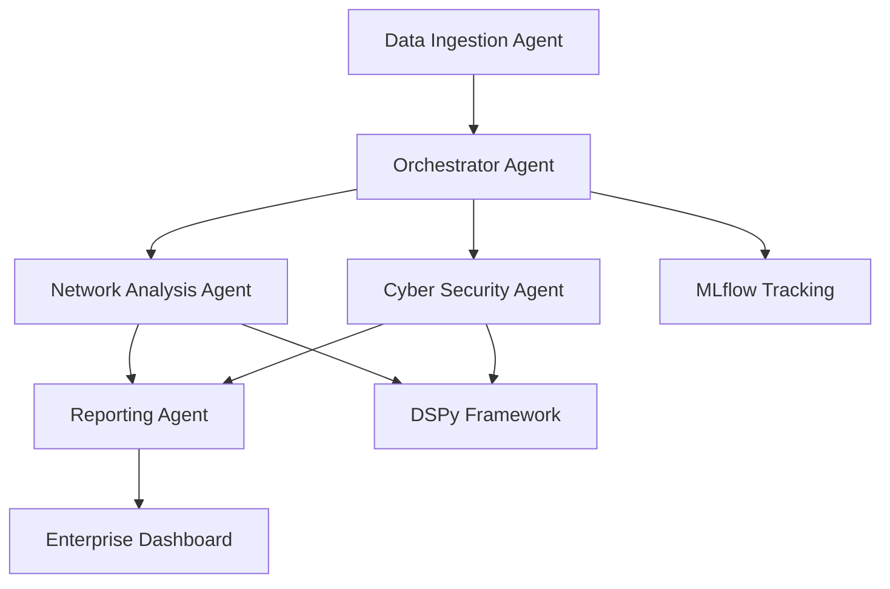

# Databricks Enterprise Insight Agent

[](https://www.python.org/downloads/)
[](https://databricks.com/)
[](https://dspy.ai/)
[](https://mlflow.org/)
[](LICENSE)

A production-grade multi-agent system for real-time monitoring and analysis of Databricks system tables, providing actionable insights on operational activities with specialized focus on networking and cybersecurity aspects.

## 🚀 Features

- **Multi-Agent Architecture**: Intelligent agents for data ingestion, network analysis, cybersecurity monitoring, orchestration, and reporting
- **DSPy Integration**: Advanced prompt optimization for LLM-based analysis
- **MLflow Tracking**: Comprehensive experiment tracking and model versioning
- **Real-time Monitoring**: Continuous analysis of Databricks system tables
- **Enterprise Security**: SOC 2 compliant with audit trails and access controls
- **Scalable Deployment**: Optimized for Databricks Jobs and Workflows
- **Evaluation Framework**: Built-in scoring and performance metrics

## 🏗️ Architecture



## 📋 Prerequisites

- Databricks Workspace with system table access
- Python 3.8+
- Databricks CLI configured
- OpenAI API key (for DSPy)

## 🛠️ Installation

1. Clone the repository:
```bash
git clone https://github.com/yourusername/databricks-insight-agent.git
cd databricks-insight-agent
```

2. Install dependencies:
```bash
pip install -r requirements.txt
```

3. Configure environment variables:
```bash
cp .env.example .env
# Edit .env with your Databricks and OpenAI credentials
```

## 🚀 Quick Start

1. Set up Databricks connection:
```python
from src.agents.data_ingestion import DataIngestionAgent

agent = DataIngestionAgent()
agent.connect_databricks()
```

2. Run the orchestrator:
```python
from src.agents.orchestrator import OrchestratorAgent

orchestrator = OrchestratorAgent()
orchestrator.run_analysis()
```

## 📊 Use Cases

- **Network Monitoring**: Detect connectivity issues, bandwidth anomalies, and traffic patterns
- **Security Analysis**: Identify unauthorized access, data exfiltration attempts, and compliance violations
- **Operational Insights**: Monitor cluster performance, job failures, and resource utilization
- **Automated Reporting**: Generate executive summaries and alert notifications

## 🔧 Configuration

See [config/](config/) for detailed configuration options including:
- Agent parameters
- DSPy optimization settings
- MLflow experiment configurations
- Databricks connection settings

## 📈 Evaluation & Scoring

The system includes comprehensive evaluation metrics:
- Agent accuracy and response time
- Insight quality scoring
- False positive/negative rates
- Performance benchmarks

## 🤝 Contributing

1. Fork the repository
2. Create a feature branch (`git checkout -b feature/amazing-feature`)
3. Commit your changes (`git commit -m 'Add amazing feature'`)
4. Push to the branch (`git push origin feature/amazing-feature`)
5. Open a Pull Request

## 📝 License

This project is licensed under the MIT License - see the [LICENSE](LICENSE) file for details.

## 🙏 Acknowledgments

- Built with [DSPy](https://dspy.ai/) for prompt optimization
- Powered by [Databricks](https://databricks.com/) platform
- Experiment tracking with [MLflow](https://mlflow.org/)

## 📞 Support

For questions and support, please open an issue on GitHub or contact the maintainers.

---

**Note**: This is a demonstration repository showcasing advanced AI engineering practices for Databricks environments. Ensure proper security measures are in place before deploying in production.